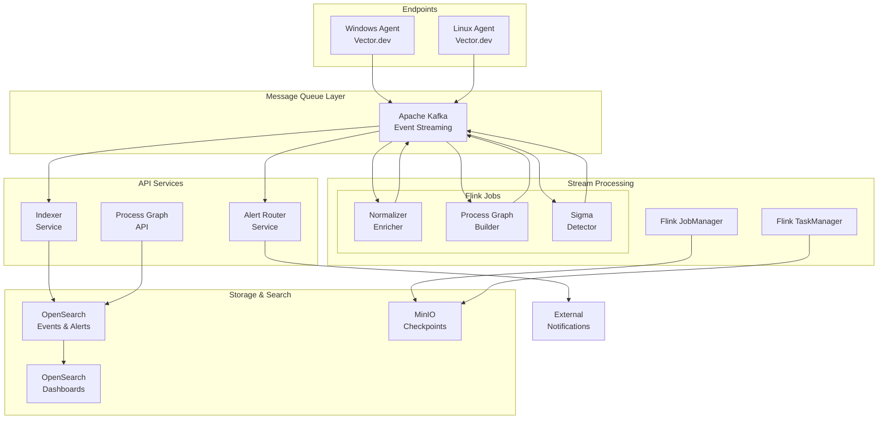

# Kiến trúc Hệ thống EDR Platform

## Tổng quan Kiến trúc

Hệ thống EDR (Endpoint Detection and Response) Platform được thiết kế theo kiến trúc microservices hiện đại, sử dụng event streaming và real-time processing để phát hiện và phản ứng với các mối đe dọa bảo mật.



## Các Thành phần Chính

### 1. Agent Layer - Tầng Thu thập Dữ liệu

#### Windows Agent
- **Công nghệ**: Vector.dev
- **Nguồn dữ liệu**:
  - Windows Security Events (4624, 4625, 4648, 4672, etc.)
  - Sysmon Operational Events (1, 3, 5, 11, 22)
  - PowerShell Execution Events (4103, 4104)
  - System Events (7034, 7040, 7045)

#### Linux Agent  
- **Công nghệ**: Vector.dev
- **Nguồn dữ liệu**:
  - Authentication logs (/var/log/auth.log, /var/log/secure)
  - System logs (/var/log/syslog, /var/log/messages)
  - Journald logs (systemd services)
  - Audit logs (/var/log/audit/audit.log)
  - Web server logs (nginx/apache access logs)
  - Fail2ban logs

#### Đặc điểm của Agent Layer:
- **Real-time Collection**: Thu thập log theo thời gian thực
- **ECS Normalization**: Chuẩn hóa dữ liệu ngay tại agent theo Elastic Common Schema
- **Buffering**: Sử dụng disk buffer để đảm bảo không mất dữ liệu
- **Secure Transport**: TLS encryption cho tất cả communication
- **Partitioning**: Sử dụng host.id làm partition key để đảm bảo ordering

### 2. Message Queue Layer - Apache Kafka

#### Kafka Topics:
- **edr-events-normalized**: Events đã được chuẩn hóa từ agents
- **edr-events-raw**: Backup raw events (optional)
- **edr-alerts**: Alerts được sinh ra bởi detection rules
- **edr-process-graph**: Process tree updates
- **edr-health**: Health check data từ agents

#### Kafka Configuration:
- **Partitions**: 6 partitions cho events chính, 3 cho alerts
- **Replication**: Factor 1 (development), 3 (production)
- **Retention**: 7 ngày cho events, 30 ngày cho alerts
- **Compression**: LZ4 để tiết kiệm bandwidth và storage

### 3. Stream Processing Layer - Apache Flink

#### Flink Jobs:

##### Normalizer-Enricher Job
```java
// Xử lý và làm giàu dữ liệu từ raw events
DataStream<Event> events = env.fromSource(kafkaSource, ...)
    .map(new NormalizationFunction())
    .map(new EnrichmentFunction()) // GeoIP, threat intel
    .sinkTo(kafkaSink);
```

##### Process Graph Builder Job
```java
// Xây dựng process tree cho mỗi host
KeyedStream<Event, String> keyedByHost = events.keyBy("host.id");
DataStream<ProcessGraphUpdate> graphUpdates = keyedByHost
    .process(new ProcessGraphFunction()) // Stateful processing
    .sinkTo(processGraphSink);
```

##### Sigma CEP Detector Job
```sql
-- Flink SQL cho Sigma rules
SELECT host_id, alert_time, process_image 
FROM Events
MATCH_RECOGNIZE (
    PARTITION BY host_id
    ORDER BY event_time
    MEASURES 
        A.process_image as process_image,
        A.event_time as alert_time
    PATTERN (A)
    DEFINE A AS A.process_image LIKE '%dfsvc.exe' 
                AND A.network_initiated = true
                AND A.destination_port NOT IN (80, 443)
);
```

#### Flink Configuration:
- **State Backend**: RocksDB cho performance cao
- **Checkpointing**: 30 giây interval, lưu trên MinIO
- **Parallelism**: 2-4 tùy theo workload
- **Memory**: JobManager 1.6GB, TaskManager 2GB

### 4. Storage & Search Layer - OpenSearch

#### Index Strategy:
- **edr-events-YYYY.MM.DD**: Daily indices cho events
- **edr-alerts-YYYY.MM.DD**: Daily indices cho alerts  
- **edr-process-graph-YYYY.MM.DD**: Process graph data

#### Index Templates:
```json
{
  "index_patterns": ["edr-events-*"],
  "template": {
    "settings": {
      "number_of_shards": 3,
      "number_of_replicas": 1,
      "refresh_interval": "5s"
    },
    "mappings": {
      "properties": {
        "@timestamp": {"type": "date"},
        "host.id": {"type": "keyword"},
        "event.action": {"type": "keyword"},
        "process.executable": {"type": "keyword"},
        "network.destination.ip": {"type": "ip"}
      }
    }
  }
}
```

### 5. API Services Layer - Go Microservices

#### Indexer Service
```go
// Bulk indexing từ Kafka vào OpenSearch
func (s *IndexerService) ProcessBatch(events []Event) error {
    bulkRequest := opensearch.BulkRequest{}
    for _, event := range events {
        indexName := fmt.Sprintf("edr-events-%s", 
            event.Timestamp.Format("2006.01.02"))
        bulkRequest.Add(opensearch.IndexOp{
            Index: indexName,
            Body:  event,
        })
    }
    return s.client.Bulk(bulkRequest)
}
```

#### Alert Router Service
```go
// Route alerts đến các notification channels
func (s *AlertRouter) RouteAlert(alert Alert) error {
    for _, rule := range s.routingRules {
        if rule.Matches(alert) {
            if !s.rateLimiter.Allow(rule.ID) {
                continue // Skip nếu rate limited
            }
            return s.sendNotification(alert, rule.Destination)
        }
    }
    return nil
}
```

#### Process Graph API
```go
// REST API cho process tree visualization
func (api *ProcessGraphAPI) GetProcessTree(hostID string, timestamp time.Time) (*ProcessTree, error) {
    query := opensearch.Query{
        Bool: opensearch.Bool{
            Must: []opensearch.Query{
                {Term: map[string]interface{}{"host.id": hostID}},
                {Range: map[string]interface{}{
                    "@timestamp": map[string]interface{}{
                        "lte": timestamp.Format(time.RFC3339),
                    },
                }},
            },
        },
    }
    // Execute query và build process tree
    return api.buildProcessTree(results)
}
```

## Data Flow - Luồng Dữ liệu

### 1. Event Collection Flow
```
Windows/Linux Endpoint 
    → Vector Agent (collect + normalize)
    → Kafka (edr-events-normalized topic)
    → Flink Jobs (process + detect)
    → Kafka (edr-alerts topic)
    → Indexer Service
    → OpenSearch (storage)
    → Dashboards (visualization)
```

### 2. Real-time Detection Flow
```
Kafka Events 
    → Flink Sigma Detector (CEP)
    → Alert Generation
    → Kafka Alerts Topic
    → Alert Router Service
    → External Notifications (Slack/Email/Webhook)
```

### 3. Process Graph Flow
```
Process Events (Sysmon Event ID 1)
    → Flink Process Graph Builder
    → Stateful Processing (RocksDB)
    → Process Tree Updates
    → Kafka Process Graph Topic
    → Indexer Service
    → OpenSearch
    → Process Graph API
    → UI Visualization
```

## Security Architecture

### 1. Transport Security
- **TLS 1.3**: Tất cả communication giữa components
- **mTLS**: Mutual authentication giữa services
- **Certificate Management**: PKI system cho production

### 2. Authentication & Authorization
- **Service-to-Service**: JWT tokens với short expiry
- **API Access**: OAuth 2.0 với RBAC
- **Admin Access**: Multi-factor authentication

### 3. Data Protection
- **Encryption at Rest**: OpenSearch indices encrypted
- **Encryption in Transit**: TLS cho tất cả network communication
- **Data Retention**: Automated cleanup theo compliance requirements
- **Audit Logging**: Tất cả admin actions được log

## Scalability & Performance

### 1. Horizontal Scaling
- **Kafka**: Thêm brokers và tăng partitions
- **Flink**: Scale TaskManagers theo workload
- **OpenSearch**: Thêm data nodes và shards
- **Go Services**: Stateless, có thể scale unlimited

### 2. Performance Optimizations
- **Kafka Batching**: Batch size 1000 events hoặc 5 seconds
- **Flink Checkpointing**: RocksDB state backend với incremental checkpoints
- **OpenSearch**: Hot-warm-cold architecture
- **Caching**: Redis cho frequent queries

### 3. Resource Requirements

#### Minimum (Development):
- **CPU**: 8 cores
- **RAM**: 16GB
- **Storage**: 100GB SSD
- **Network**: 1Gbps

#### Production (100k endpoints):
- **CPU**: 64+ cores
- **RAM**: 128GB+
- **Storage**: 10TB+ NVMe SSD
- **Network**: 10Gbps+

## Monitoring & Observability

### 1. Metrics Collection
- **Kafka**: JMX metrics cho throughput, lag, errors
- **Flink**: JobManager metrics, checkpoint duration, backpressure
- **OpenSearch**: Cluster health, indexing rate, query performance
- **Go Services**: Prometheus metrics cho HTTP requests, processing time

### 2. Logging Strategy
- **Structured Logging**: JSON format cho tất cả services
- **Log Levels**: ERROR, WARN, INFO, DEBUG
- **Centralized**: Tất cả logs đều đi vào OpenSearch
- **Retention**: 30 ngày cho application logs

### 3. Alerting Rules
- **High Priority**: Service down, data loss, security alerts
- **Medium Priority**: Performance degradation, resource usage
- **Low Priority**: Configuration changes, maintenance events

## Disaster Recovery

### 1. Backup Strategy
- **Kafka**: Replicated topics across multiple brokers
- **Flink**: Checkpoints stored on MinIO với S3 replication
- **OpenSearch**: Snapshots to S3-compatible storage
- **Configuration**: GitOps với version control

### 2. Recovery Procedures
- **RTO**: 15 minutes cho core services
- **RPO**: 5 minutes data loss maximum
- **Failover**: Automated với health checks
- **Testing**: Monthly disaster recovery drills

## Compliance & Governance

### 1. Data Governance
- **Data Classification**: Public, Internal, Confidential, Restricted
- **Data Lineage**: Track data từ source đến destination
- **Data Quality**: Validation rules và monitoring
- **Privacy**: GDPR/CCPA compliance với data masking

### 2. Audit & Compliance
- **SOC 2**: Security controls và monitoring
- **ISO 27001**: Information security management
- **PCI DSS**: Payment card data protection (nếu applicable)
- **Audit Logs**: Immutable audit trail cho tất cả actions

---

*Tài liệu này được cập nhật thường xuyên. Phiên bản mới nhất luôn có trên company wiki.*
